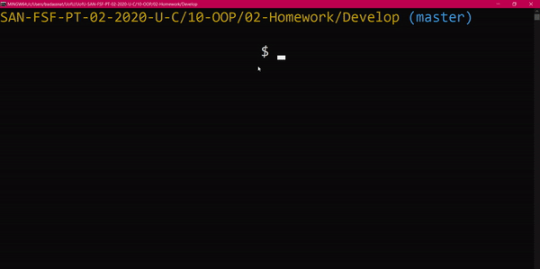

# **Team-Profile-Generator**

## **Challenge**

The challenge was to build a Node CLI that takes in information about employees and generates an HTML webpage that displays summaries for each person.

## **Requirements**

* Functional application.

* GitHub repository with a unique name and a README describing the project.

* User can use the CLI to generate an HTML page that displays information about their team.

* All tests must pass.

## **Description**

Retaining existing code that didn't need adjustment, I "filled in the blanks" on some areas and had to start from scratch for others. After creating the "Employee" class & JS script, 

I was able to link three separate sheets to it for the employee categories, "Manager", "Engineer", and "Intern". 

Once that was complete, I was able to adjust the html render sheet as needed. 

I then worked on app.js by defining the function that would initialize the test, creating a questions array that matched the requirements of the README, and created another function to call the first question of the loop. 

Once I had my necessary code laid out, I had to go back and refractor it so some errors were corrected. At first, the test would not loop through the cycle after the first run. It also did not provide data if the user inputed "No" rather than "Yes". Once I fixed the errors, then I cleaned/dried up the code to make it look nicer. 

I could go back and style the HTML test page that displays the results of the tests, but that is not as necessary as making the test work properly. 

## **Video of Deployed Application**

## **Picture of Test Results**

